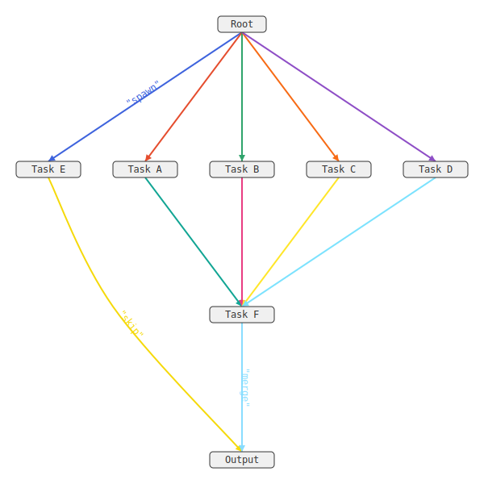

# zigraph

[](LICENSE)

**Zero-dependency graph layout engine for Zig.** Visualize DAGs, dependency trees, and flow graphs in terminals, SVG, or JSON.

<table>
<tr>
<td><strong>Terminal (Unicode)</strong></td>
<td><strong>SVG (Debug)</strong></td>
<td><strong>SVG (Splines)</strong></td>
<td><strong>SVG (Labels on Path)</strong></td>
</tr>
<tr>
<td>


</td>
<td>


</td>
<td>


</td>
<td>



</td>
</tr>
</table>

## Features

- **Zero dependencies** — Pure Zig, no libc required
- **Two layout engines** — Sugiyama (hierarchical DAGs) and Fruchterman-Reingold (force-directed)
- **Directed & undirected edges** — `addDiEdge` / `addUnDiEdge` with per-edge arrow control
- **Three renderers** — Unicode (terminal), SVG (with splines), JSON (for tooling)
- **Edge labels** — Annotate edges with text, rendered in all output formats
- **Pluggable algorithms** — Bring your own crossing reduction, positioning, routing
- **Comptime graphs** — Build diagrams at compile time, embed as string literals
- **Embedded-first** — Explicit allocators, ~40KB WASM target

## Installation

Run this command to add zigraph to your project:

```bash
zig fetch --save git+https://github.com/AshutoshMahala/zigraph
```

Then in `build.zig`:

```zig
const zigraph = b.dependency("zigraph", .{});
exe.root_module.addImport("zigraph", zigraph.module("zigraph"));
```

## API Usage

### 1. Unicode Renderer (Terminal)

```zig
const zigraph = @import("zigraph");

// Render with ANSI colors (optional)
const output = try zigraph.unicode.renderWithConfig(&ir, allocator, .{
    .edge_palette = &zigraph.colors.ansi_dark,
    .show_dummy_nodes = false, 
});
defer allocator.free(output);
std.debug.print("{s}\n", .{output});
```

### 2. SVG Renderer (Web/Vector)

```zig
// Render directly layout IR to SVG
const svg = try zigraph.svg.render(&ir, allocator, .{
    .edge_palette = &zigraph.colors.radix,
    .color_edges = true,
    .stitch_splines = true, // Smooth curves
});
defer allocator.free(svg);
```

### 3. JSON Renderer (Integration)

```zig
// Export layout data for external tools
const json = try zigraph.json.render(&ir, allocator);
defer allocator.free(json);
```

See [JSON_SCHEMA.md](JSON_SCHEMA.md) for data format details.

## Quick Start

```zig
const std = @import("std");
const zigraph = @import("zigraph");

pub fn main() !void {
    var gpa = std.heap.GeneralPurposeAllocator(.{}){};
    defer _ = gpa.deinit();
    const allocator = gpa.allocator();

    // Build graph
    var graph = zigraph.Graph.init(allocator);
    defer graph.deinit();
    
    try graph.addNode(1, "Parse");
    try graph.addNode(2, "Compile");
    try graph.addNode(3, "Link");
    try graph.addDiEdge(1, 2);                     // directed edge (arrow)
    try graph.addDiEdgeLabeled(2, 3, "link");       // directed + labeled
    // try graph.addUnDiEdge(1, 3);                 // undirected (no arrow)

    // Layout using a preset (recommended)
    const output = try zigraph.render(&graph, allocator, zigraph.presets.sugiyama.standard());
    defer allocator.free(output);
    
    std.debug.print("{s}\n", .{output});
}
```

Output:
```text
[Parse]
   │
   ↓
[Compile]
   │
   ↓
 [Link]
```

## Edge Labels

Annotate edges with descriptive text:

```zig
try graph.addDiEdgeLabeled(1, 2, "requires");
try graph.addDiEdgeLabeled(2, 3, "queries");
try graph.addDiEdge(1, 3);  // unlabeled edge
```

Labels appear in all renderers — terminal, SVG, and JSON.

## Directed & Undirected Edges

zigraph supports directed, undirected, and mixed graphs:

```zig
try graph.addDiEdge(1, 2);           // directed: renders with arrow (→)
try graph.addUnDiEdge(2, 3);         // undirected: renders without arrow (—)
try graph.addDiEdgeLabeled(1, 3, "dep");    // directed + labeled
try graph.addUnDiEdgeLabeled(3, 4, "link"); // undirected + labeled

// Legacy aliases still work:
try graph.addEdge(1, 2);             // same as addDiEdge
try graph.addEdgeLabeled(1, 2, "x"); // same as addDiEdgeLabeled
```

## Presets (Recommended)

Presets provide curated configurations for common use cases:

```zig
const zigraph = @import("zigraph");

// Sugiyama (hierarchical DAG layout)
const ir = try zigraph.layout(&graph, allocator, zigraph.presets.sugiyama.standard());
const ir_fast = try zigraph.layout(&graph, allocator, zigraph.presets.sugiyama.fast());
const ir_quality = try zigraph.layout(&graph, allocator, zigraph.presets.sugiyama.quality());

// Force-directed (any graph type)
const ir_fdg = try zigraph.layout(&graph, allocator, zigraph.presets.fdg_presets.standard());
const ir_fdg_fast = try zigraph.layout(&graph, allocator, zigraph.presets.fdg_presets.fast());
```

| Preset | Use Case | Speed |
|--------|----------|-------|
| `sugiyama.standard()` | DAGs, balanced quality/speed | ★★★ |
| `sugiyama.fast()` | Large DAGs, speed priority | ★★★★ |
| `sugiyama.quality()` | Small DAGs, best visuals | ★★ |
| `fdg_presets.standard()` | General graphs < 500 nodes | ★★★ |
| `fdg_presets.fast()` | Large graphs 500-10000 nodes | ★★★★ |

## Force-Directed Layout (FDG)

For non-hierarchical or general graphs, use the Fruchterman-Reingold algorithm:

```zig
const zigraph = @import("zigraph");

// Use preset (recommended)
var ir = try zigraph.layout(&graph, allocator, zigraph.presets.fdg_presets.standard());
var ir_fast = try zigraph.layout(&graph, allocator, zigraph.presets.fdg_presets.fast());

// Or manual config for fine control
var ir_custom = try zigraph.layout(&graph, allocator, .{
    .algorithm = .{ .fruchterman_reingold = .{} },
});
defer ir_custom.deinit();
```

### FDG Perf (Apple M2)

| Nodes | FR Standard | FR-Fast (Barnes-Hut) | Speedup |
|-------|-------------|----------------------|---------|
| 500   | 11 ms       | 5 ms                 | 2.2×    |
| 1000  | 42 ms       | 11 ms                | 3.8×    |
| 5000  | 1040 ms     | 28 ms                | 37.6×   |

### SVG Label Modes

```zig
// Default: labels centered at edge midpoint
const svg = try zigraph.svg.render(&ir, allocator, .{
    .color_edges = true,
});

// Text-on-path: labels follow the edge curve
const svg_path = try zigraph.svg.render(&ir, allocator, .{
    .color_edges = true,
    .labels_on_path = true,  // uses SVG <textPath>
});
```

SVG labels are automatically oriented left-to-right (never upside-down) and centered on the geometric midpoint of each edge.

## Renderers

### Unicode (Terminal)

```zig
const output = try zigraph.render(&graph, allocator, .{});
```

### SVG

```zig
var ir = try zigraph.layout(&graph, allocator, .{ .routing = .spline });
defer ir.deinit();

const svg = try zigraph.svg.render(&ir, allocator, .{
    .edge_palette = &zigraph.colors.radix,  // Colored edges
    .stitch_splines = true,                  // Smooth curves (default)
    .labels_on_path = true,                  // Labels follow edge curves
    .show_control_points = true,             // Debug splines
});
```

### JSON

```zig
const json = try zigraph.exportJson(&graph, allocator, .{});
```

See [JSON_SCHEMA.md](JSON_SCHEMA.md) for the output format, or view [assets/hero.json](assets/hero.json) for an example.

## Configuration

For fine-grained control, configure manually (or start with a preset and override):

```zig
const output = try zigraph.render(&graph, allocator, .{
    // Layering
    .layering = .longest_path,        // default: simple, fast
    // .layering = .network_simplex,   // optimal: minimizes total edge span
    // .layering = .network_simplex_fast, // bounded iterations, good for large graphs

    // Positioning
    .positioning = .none,  // default: left-to-right packing (no collisions)
    // .positioning = .simple,        // level centering (has collision issues)
    // .positioning = .brandes_kopf,  // parent/child centering (has collision issues)

    // Crossing reduction
    .crossing_reducers = &zigraph.crossing.balanced,  // default
    // .crossing_reducers = &zigraph.crossing.fast,   // speed
    // .crossing_reducers = &zigraph.crossing.quality, // best

    // Edge routing
    .routing = .direct,  // or .spline

    // Spacing
    .node_spacing = 3,
    .level_spacing = 2,

    // Performance
    .skip_validation = false,
});
```

### Custom Crossing Reduction

Compose your own pipeline:

```zig
.crossing_reducers = &[_]zigraph.crossing.Reducer{
    zigraph.crossing.medianReducer(4),
    zigraph.crossing.adjacentExchangeReducer(2),
    zigraph.crossing.medianReducer(2),  // polish
},
```

Or bring your own algorithm:

```zig
fn myReducer(self: *const zigraph.crossing.Reducer, levels: *VirtualLevels, g: *const Graph, alloc: Allocator) !void {
    // Custom crossing reduction logic
}

.crossing_reducers = &[_]zigraph.crossing.Reducer{
    zigraph.crossing.medianReducer(2),
    .{ .runFn = myReducer, .passes = 5 },
},
```

## Comptime Graphs

Build diagrams at compile time with zero runtime allocation:

```zig
const ComptimeGraph = @import("zigraph").ComptimeGraph;

const diagram = comptime blk: {
    var g = ComptimeGraph.init();
    g.edge(1, 2);
    g.edge(2, 3);
    break :blk g.render();
};

pub fn main() void {
    // diagram is embedded in binary - no allocations!
    std.debug.print("{s}\n", .{diagram});
}
```

## Performance

Benchmarks on Apple M2 (zig build run-benchmark):

| Nodes | Edges | Layout | Render | Total |
|-------|-------|--------|--------|-------|
| 100 | 200 | 1.0 ms | 0.03 ms | 1.0 ms |
| 1,000 | 2,000 | 57 ms | 0.1 ms | 57 ms |
| 10,000 | 20,000 | 4.5 s | 1.4 ms | 4.5 s |

### Crossing Reduction Comparison (100 nodes)

| Preset | Time | Description |
|--------|------|-------------|
| `none` | 0.03 ms | No reduction |
| `fast` | 0.04 ms | median(2) |
| `balanced` | 0.6 ms | median(4) + exchange(2) |
| `quality` | 0.6 ms | median(8) + exchange(4) + median(2) |

### Complexity

- **Layout**: O(passes × (V + E)) dominated by crossing reduction (V=nodes, E=edges)
- **Render**: O(W × H) where W×H is output dimensions

### Recommendations

- **<100 nodes**: Use `crossing.quality` for best results
- **100-1000 nodes**: Use `crossing.balanced` (default)
- **>1000 nodes**: Use `crossing.fast` or `skip_validation = true`
- **Wide layers (>20 nodes)**: Adjacent exchange auto-skips for performance

## Architecture

zigraph implements two layout engines:

1. **Sugiyama** (hierarchical layout for DAGs):
   Layering → Crossing reduction → Positioning → Routing

2. **Fruchterman-Reingold** (force-directed for general graphs):
   FR Standard (O(V²)) or FR-Fast with Barnes-Hut quadtree (O(V log V))

```text
┌─────────────────────────────────────────────────────────────────┐
│                          User API                               │
│  zigraph.render() / zigraph.layout() / zigraph.exportJson()     │
├─────────────────────────────────────────────────────────────────┤
│  ┌──────────────────────────┐  ┌─────────────────────────────┐  │
│  │       Sugiyama           │  │   Force-Directed (FDG)      │  │
│  │ ┌─────────┬──────────┐   │  │                             │  │
│  │ │Layering │ Crossing │   │  │ FR Standard (O(V²))         │  │
│  │ │ lp / ns │ med / ae │   │  │ FR-Fast (Barnes-Hut O(VlogV)│  │
│  │ ├─────────┼──────────┤   │  │ Q16.16 fixed-point          │  │
│  │ │Position │ Routing  │   │  │ Deterministic               │  │
│  │ │ bk / s  │ dir / sp │   │  │                             │  │
│  │ └─────────┴──────────┘   │  └─────────────────────────────┘  │
│  └──────────────────────────┘                                   │
├─────────────────────────────────────────────────────────────────┤
│                        Layout IR                                │
│  LayoutIR(usize) { nodes, edges, width, height }                │
├─────────────────────────────────────────────────────────────────┤
│                        Renderers                                │
│  ┌──────────────┬──────────────────┬─────────────────────────┐  │
│  │   Unicode    │      SVG         │         JSON            │  │
│  │ (terminal)   │ (splines,colors) │ (for external tools)    │  │
│  └──────────────┴──────────────────┴─────────────────────────┘  │
└─────────────────────────────────────────────────────────────────┘
```

See [ARCHITECTURE.md](ARCHITECTURE.md) for detailed design decisions.

## Use Cases

- **CLI tools** — Error chain visualization, build graphs
- **Compilers** — AST/IR visualization
- **Documentation** — Embedded diagrams
- **Embedded systems** — Diagnostics on microcontrollers
- **WASM dashboards** — Browser-based visualization

## Examples

```bash
zig build run-example      # Basic usage
zig build run-hero         # README hero diagram
zig build run-presets      # Presets demo (all presets side-by-side)
zig build run-config       # Configuration options demo
zig build run-svg          # SVG with splines
zig build run-labels       # Edge labels demo (exports SVG)
zig build run-ns-compare   # Compare layering algorithms
zig build run-json         # JSON export
zig build run-comptime     # Comptime graphs
zig build run-fdg          # Force-directed layout (terminal + SVG)
zig build run-fdg-bench    # FDG performance benchmarks
zig build run-stress       # Stress test suite
zig build run-benchmark    # Sugiyama benchmarks
```

## License

Licensed under either of:

- Apache License, Version 2.0 ([LICENSE-APACHE](LICENSE-APACHE))
- MIT license ([LICENSE-MIT](LICENSE-MIT))

at your option.

---

Created by [Ash](https://github.com/AshutoshMahala) • Inspired by [ascii-dag](https://github.com/AshutoshMahala/ascii-dag) (Rust)
