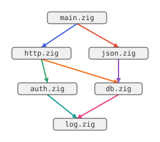
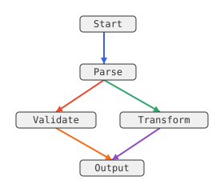
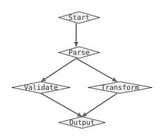
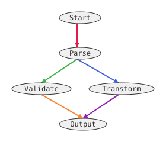
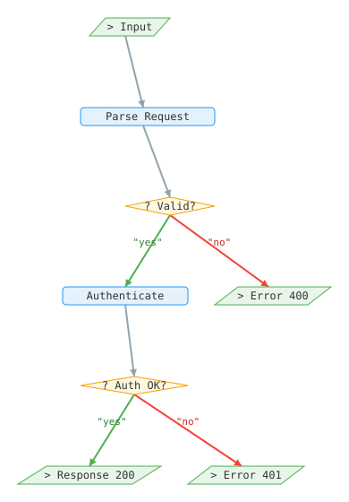
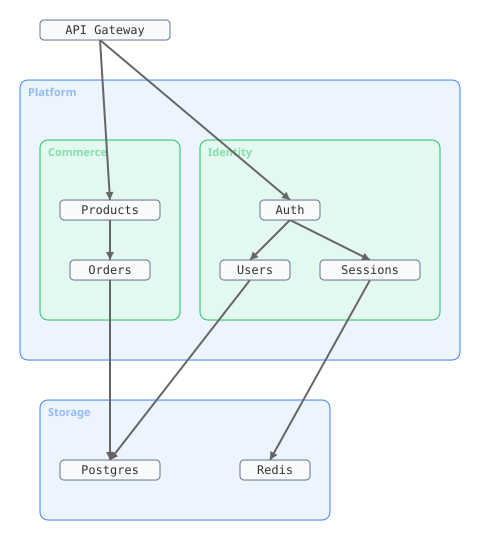
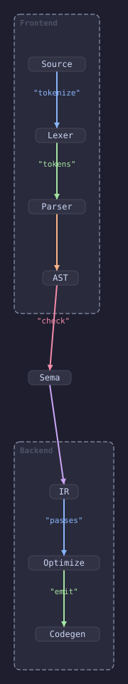
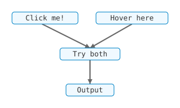
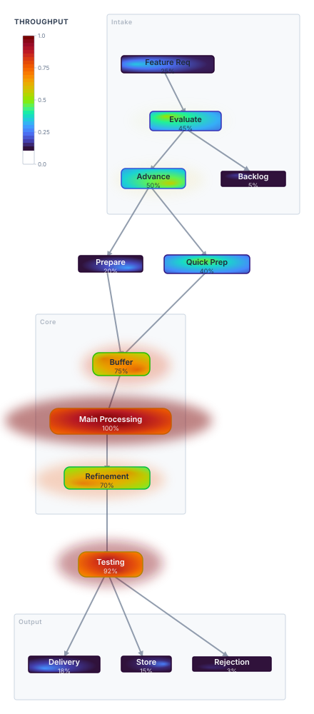

# SVG Customization Guide

This guide shows how to use the SVG renderer's style function API to customize every visual aspect of your graph output.

> **Gallery examples** — Runnable code for each section lives in `examples/svg/`.
> Run all at once with `zig build run-svg-gallery`, or individually: `zig build run-svg-01`, etc.
> Output lands in `assets/gallery/*.svg` — open in a browser to see the results.

### 01 — Basic ([source](../examples/svg/01_basic.zig))

Zero-config rendering — the simplest possible SVG output.



---

### 02 — Shape Presets ([source](../examples/svg/02_presets.zig))

One-liner shape swaps: diamonds, ellipses, monochrome edges — 3 SVGs from 1 graph.

| Default (rounded rect) | Diamond | Ellipse + mono edges |
|---|---|---|
|  |  |  |

---

### 03 — Flowchart ([source](../examples/svg/03_flowchart.zig))

Conditional shapes (diamond for decisions, parallelogram for I/O) with colored edge labels.



---

### 04 — Clusters ([source](../examples/svg/04_clusters.zig))

Depth-aware subgraph styling using `SubgraphStyleContext.depth`.



---

### 05 — Dark Theme ([source](../examples/svg/05_dark_theme.zig))

Full dark theme using all 4 style functions + `global_style` CSS injection.



---

### 06 — Interactive ([source](../examples/svg/06_interactive.zig))

CSS hover highlights + JavaScript click events via `global_style` / `global_script`.



---

### 07 — Stress Heatmap ([source](../examples/svg/07_heatmap.zig))

FEA-style stress visualization: per-node turbo radial gradients, gaussian blur glow spill,
variable node sizing, dual stress concentrations, and a color scale legend.



## Overview

The SVG renderer is fully driven by **4 style function pointers** on `SvgConfig`. Each function receives a context struct describing what's being rendered and returns a style struct controlling how it looks.

| Function pointer | Context | Style return | What it controls |
|---|---|---|---|
| `edge_style_fn` | `EdgeStyleContext` | `EdgeStyle` | Stroke color, markers, defs, extra attrs |
| `node_style_fn` | `NodeStyleContext` | `NodeStyle` | Shape SVG, fill, stroke, defs, extra attrs |
| `edge_label_style_fn` | `EdgeStyleContext` | `EdgeLabelStyle` | Label color, font, size, position |
| `subgraph_style_fn` | `SubgraphStyleContext` | `SubgraphStyle` | Box SVG, fill, stroke, defs, extra attrs |

Plus two injection fields for global CSS/JS:

| Field | Purpose |
|---|---|
| `global_style` | `<style>` block injected into `<defs>` |
| `global_script` | `<script>` block injected at end of SVG |

## Quick start

> **See it:** [01_basic.zig](../examples/svg/01_basic.zig) — output shown in the gallery above

```zig
const zigraph = @import("zigraph");
const svg = zigraph.svg;

// Default config — all defaults produce clean output
const output = try svg.render(&layout, allocator, .{});

// Custom node shapes
const output = try svg.render(&layout, allocator, .{
    .node_style_fn = &svg.shapes.diamond,
});

// Monochrome edges (no colored palette)
const output = try svg.render(&layout, allocator, .{
    .edge_style_fn = &svg.monoEdgeStyle,
});
```

## Node shapes

> **See it:** [02_presets.zig](../examples/svg/02_presets.zig) for one-liner preset swaps, [03_flowchart.zig](../examples/svg/03_flowchart.zig) for conditional shapes

Six built-in shape presets are available in `zigraph.shapes` (or `svg.shapes`):

| Preset | Description |
|---|---|
| `shapes.rounded_rectangle` | Default. Rounded corners (`rx=4`). |
| `shapes.rectangle` | Sharp corners. |
| `shapes.ellipse` | Elliptical node. |
| `shapes.diamond` | 45° rotated square (decision nodes). |
| `shapes.hexagon` | Six-sided polygon. |
| `shapes.circle` | Equal width/height circle. |

### Custom node shapes

Write a function that returns a `NodeStyle` with `shape_svg` containing raw SVG:

```zig
fn myDatabaseShape(ctx: zigraph.NodeStyleContext) zigraph.NodeStyle {
    // ctx.width and ctx.height are in pixels (already scaled by char_width/line_height)
    const w = ctx.width;
    const h = ctx.height;
    return .{
        .shape_svg = std.fmt.allocPrint(ctx.arena,
            \\<ellipse cx="{d}" cy="4" rx="{d}" ry="4"/>
            \\<rect x="0" y="4" width="{d}" height="{d}"/>
            \\<ellipse cx="{d}" cy="{d}" rx="{d}" ry="4"/>
            \\<text x="{d}" y="{d}" text-anchor="middle" fill="#333" stroke="none">{s}</text>
        , .{ w / 2, w / 2, w, h - 8, w / 2, h - 4, w / 2, w / 2, h / 2 + 4, ctx.label }) catch "",
        .fill = "#e8f4fd",
        .stroke = "#3b82f6",
    };
}

const output = try svg.render(&layout, allocator, .{
    .node_style_fn = &myDatabaseShape,
});
```

The `shape_svg` string is placed inside a `<g>` element with `transform`, `fill`, and `stroke` already set. The SVG you provide should use coordinates relative to the node's origin `(0, 0)`.

### Conditional styling

```zig
fn styleByLabel(ctx: zigraph.NodeStyleContext) zigraph.NodeStyle {
    if (std.mem.eql(u8, ctx.label, "Error")) {
        return .{
            .shape_svg = zigraph.shapes.rounded_rectangle(ctx).shape_svg,
            .fill = "#fee2e2",
            .stroke = "#e5484d",
        };
    }
    return zigraph.shapes.rounded_rectangle(ctx);
}
```

## Edge styling

> **See it:** [03_flowchart.zig](../examples/svg/03_flowchart.zig) uses semantic edge colors (green/red for yes/no)

The default `edge_style_fn` cycles through the Radix color palette and adds directional arrows.

### Custom edge colors

```zig
fn redEdges(ctx: zigraph.EdgeStyleContext) zigraph.EdgeStyle {
    _ = ctx;
    return .{
        .stroke = "#e5484d",
        .marker_end = .arrow,
    };
}

const output = try svg.render(&layout, allocator, .{
    .edge_style_fn = &redEdges,
});
```

### Marker shapes

Seven marker shapes are available via `MarkerShape`:

| Shape | Description |
|---|---|
| `.none` | No marker |
| `.arrow` | Filled arrowhead (default for directed) |
| `.open_arrow` | Outline arrowhead (UML inheritance) |
| `.diamond` | Filled diamond (UML composition) |
| `.open_diamond` | Outline diamond (UML aggregation) |
| `.circle` | Filled circle |
| `.open_circle` | Outline circle |

```zig
fn umlComposition(ctx: zigraph.EdgeStyleContext) zigraph.EdgeStyle {
    _ = ctx;
    return .{
        .stroke = "#333",
        .marker_start = .diamond,  // composition diamond at source
        .marker_end = .arrow,
    };
}
```

### Edge defs and extra attributes

```zig
fn dashedEdge(ctx: zigraph.EdgeStyleContext) zigraph.EdgeStyle {
    _ = ctx;
    return .{
        .stroke = "#666",
        .marker_end = .arrow,
        .extra_attrs = "stroke-dasharray=\"5,3\" opacity=\"0.7\"",
    };
}
```

## Edge label styling

```zig
fn boldLabels(ctx: zigraph.EdgeStyleContext) zigraph.EdgeLabelStyle {
    _ = ctx;
    return .{
        .color = "#e5484d",
        .font_family = "sans-serif",
        .font_size = 14,
        .extra_attrs = "font-weight=\"bold\"",
    };
}

const output = try svg.render(&layout, allocator, .{
    .edge_label_style_fn = &boldLabels,
});
```

### Label position

The `position` field (0–100) controls where along the edge the label is placed:
- `50` (default) — midpoint
- `10` — near the source
- `90` — near the target

### On-path labels

Labels can be rendered as `<textPath>` following the edge curve:

```zig
// Global setting
const output = try svg.render(&layout, allocator, .{
    .labels_on_path = true,
});

// Or per-edge override via EdgeLabelStyle
fn onPathLabels(_: zigraph.EdgeStyleContext) zigraph.EdgeLabelStyle {
    return .{ .on_path = true };
}
```

## Subgraph styling

> **See it:** [04_clusters.zig](../examples/svg/04_clusters.zig) — output shown in the gallery above

```zig
fn depthAwareSubgraph(ctx: zigraph.SubgraphStyleContext) zigraph.SubgraphStyle {
    const fills = [_][]const u8{ "#e8f4fd", "#e6f4ea", "#fff4e6" };
    const strokes = [_][]const u8{ "#3b82f6", "#30a46c", "#f59e0b" };

    return .{
        .box_svg = std.fmt.allocPrint(ctx.arena,
            \\<rect x="0" y="0" width="{d}" height="{d}" rx="6" ry="6"/>
            \\<text x="8" y="16" font-family="monospace" font-size="12"
            \\      fill="{s}" stroke="none">{s}</text>
        , .{ ctx.width, ctx.height, strokes[ctx.depth % 3], ctx.label }) catch "",
        .fill = fills[ctx.depth % fills.len],
        .stroke = strokes[ctx.depth % strokes.len],
    };
}
```

## Global CSS and JavaScript

> **See it:** [05_dark_theme.zig](../examples/svg/05_dark_theme.zig) for full CSS theming, [06_interactive.zig](../examples/svg/06_interactive.zig) for hover + click

Inject CSS for hover effects, animations, or theming:

```zig
const output = try svg.render(&layout, allocator, .{
    .global_style =
        \\<style>
        \\  .node:hover { opacity: 0.8; cursor: pointer; }
        \\  text { font-family: 'Inter', sans-serif; }
        \\</style>
    ,
    .global_script =
        \\<script>
        \\  document.querySelectorAll('g[id^="node-"]').forEach(el => {
        \\    el.addEventListener('click', () => console.log(el.id));
        \\  });
        \\</script>
    ,
});
```

- `global_style` is placed inside `<defs>` (available before rendering)
- `global_script` is placed at the end of the SVG (DOM is ready)

## Type-erased Renderer

For generic code that works with any renderer backend:

```zig
const zigraph = @import("zigraph");

fn renderToFile(
    layout: *const zigraph.LayoutIR,
    renderer: zigraph.Renderer,
    path: []const u8,
    allocator: std.mem.Allocator,
) !void {
    const output = try renderer.render(layout, allocator);
    defer allocator.free(output);
    try std.fs.cwd().writeFile(.{ .sub_path = path, .data = output });
}

// Use with any backend:
const svg_config = zigraph.svg.SvgConfig{};
try renderToFile(&layout, zigraph.Renderer.initSvg(&svg_config), "out.svg", alloc);
try renderToFile(&layout, zigraph.Renderer.initJson(), "out.json", alloc);
```

## Arena allocator pattern

All style functions receive an `arena` allocator in their context. Use it for dynamic string formatting — the memory is bulk-freed when the render pass completes:

```zig
fn dynamicColor(ctx: zigraph.NodeStyleContext) zigraph.NodeStyle {
    const color = std.fmt.allocPrint(ctx.arena, "hsl({d}, 70%, 50%)", .{
        (ctx.node_id * 137) % 360,
    }) catch "#999";

    return .{
        .shape_svg = zigraph.shapes.rounded_rectangle(ctx).shape_svg,
        .fill = color,
        .stroke = "#333",
    };
}
```

There is zero cost for style functions that return static string literals (which covers most use cases).
